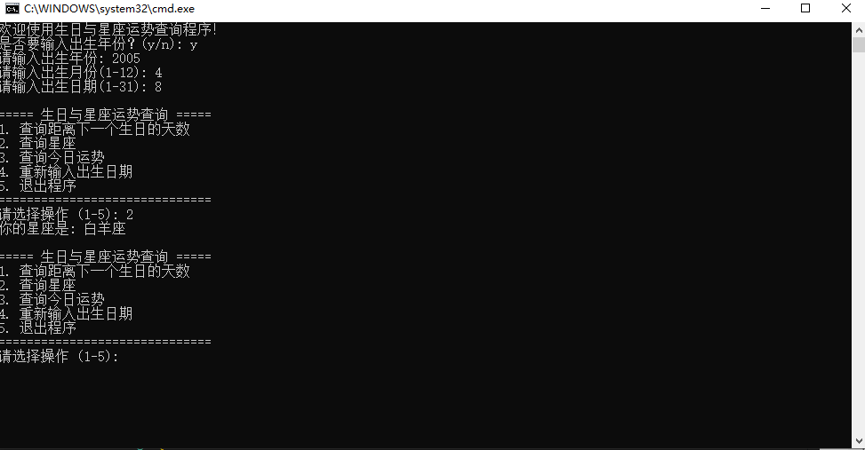

# 1. Project Title
## 生日与星座运势查询系统 （Birthday & Zodiac Fortune Query System）
> 基于 C++ 开发的轻量级控制台应用，适配 Visual Studio 开发环境，支持输入出生日期查询生日倒计时、已存活天数、匹配专属星座，生成每日个性化运势，还可将运势结果导出为文本文件，操作简单且功能实用。
  
# 2. Getting Started（快速开始）
  
## 2.1 Prerequisites（依赖项）
> 无需第三方库，仅需以下 Visual Studio 环境：
开发工具：Visual Studio 2015 及以上版本（推荐 2019/2022 社区版，免费且功能完善）
组件要求：安装 “使用 C++ 的桌面开发” 工作负载（VS 安装时需勾选）
C++ 标准：支持 C++11 及以上（VS 2015+ 原生兼容）
操作系统：Windows 7/10/11（VS 主流支持系统）
  
## 2.2 Installing（VS 环境配置与项目创建）
> 步骤 1：安装 Visual Studio
访问 Visual Studio 官网，下载 Visual Studio 2022 社区版。
运行安装程序，在 “工作负载” 页面勾选 “使用 C++ 的桌面开发”，点击 “安装”（等待安装完成，约需 10-30 分钟，取决于网络速度）。
步骤 2：创建 VS 控制台项目
打开 Visual Studio，点击 “创建新项目”。
在模板列表中搜索 “控制台应用”，选择 “控制台应用 (.exe)”，点击 “下一步”。
配置项目信息：
项目名称：输入 BirthdayFortune（建议英文，无空格）
位置：选择本地保存路径（如 D:\VS_Projects）
解决方案名称：默认与项目名称一致
取消勾选 “将解决方案和项目放在同一目录中”（便于后续管理文件）
点击 “创建”，VS 自动生成包含默认代码的 BirthdayFortune.cpp 文件。
步骤 3：替换源码与配置编译选项
右键点击 BirthdayFortune.cpp（解决方案资源管理器中），选择 “打开”，删除默认代码，将完整的项目 C++ 源码粘贴进去。
配置 C++ 标准：
右键点击项目名称 → “属性”
左侧导航栏选择 “配置属性 → C/C++ → 语言”
“C++ 语言标准” 下拉选择 “ISO C++11 标准 (/std:c++11)”（或更高版本，如 C++14/C++17）
点击 “确定” 保存配置
  
# 3. Usage（VS 中使用指南）
## 3.1 程序交互流程
### 1  输入出生日期
> 程序启动后，首先询问：是否要输入出生年份？(y/n):
输入 y：依次输入 4 位年份（如 2000）、月份（1-12）、日期（1-31）。
输入 n：仅输入月份和日期，程序默认使用当前年份计算。
注：若输入无效日期（如 2 月 30 日），会提示重新输入。
### 2 主菜单操作
> 出生日期输入完成后，显示主菜单
    ===== 生日与星座运势查询 =====
    1. 查询距离下一个生日的天数
    2. 查询星座
    3. 查询今日运势
    4. 重新输入出生日期
    5. 退出程序
    ==============================
    请选择操作 (1-5): 
## 3.2 功能使用示例
>功能 1：查询生日相关天数
操作：菜单输入 1
示例输出（假设出生年份 2000，今日 2024-10-01，生日 12-30）：
plaintext
距离下一个生日还有 89 天。
你已经出生了 8992 天。
  
>功能 2：查询星座
操作：菜单输入 2
示例输出（生日 12-30）：
plaintext
你的星座是: 摩羯座
  
>功能 3：查询今日运势并导出
操作：菜单输入 3 → 查看运势后输入 y → 输入文本文件名（如 capricorn_today.txt）
示例输出：
plaintext
摩羯座今日运势: 人际关系方面会有好的发展，多与他人交流。
是否要将运势导出到文件？(y/n): y
请输入文件名: capricorn_today.txt
成功导出至 capricorn_today.txt
文本文件位置：默认保存在项目 x64\Debug 目录下，打开文件可看到：
plaintext
日期: 2024-10-01
星座: 摩羯座
运势: 人际关系方面会有好的发展，多与他人交流。
  
  
>功能 4：重新输入出生日期
操作：菜单输入 4 → 按 “输入出生日期” 流程重新操作，支持多用户查询。
  
>功能 5：退出程序
操作：菜单输入 5
示例输出：
plaintext
感谢使用，再见！

  
# 4. VS 项目结构说明
    BirthdayFortune/                  # 解决方案目录
    ├── BirthdayFortune/              # 项目目录
    │   ├── BirthdayFortune.cpp       # 主源码文件（核心逻辑）
    │   ├── BirthdayFortune.vcxproj   # VS 项目配置文件
    │   └── BirthdayFortune.vcxproj.filters # 文件过滤配置
    ├── x64/                          # 64位编译输出目录
    │   └── Debug/                    # 调试模式输出目录
    │       ├── BirthdayFortune.exe   # 程序可执行文件
    │       └── capricorn_today.txt   # 导出的运势文本文件（示例）
    └── BirthdayFortune.sln           # VS 解决方案文件（双击打开项目）
  
# 5. VS 使用注意事项
>控制台自动关闭：若用 “开始调试”（F5）运行，程序结束后控制台会自动关闭，建议用 “开始执行 (不调试)”（Ctrl+F5），或在 main 函数末尾添加 system("pause"); 暂停。
编译错误排查：
若提示 “无法打开源文件”：检查 BirthdayFortune.cpp 是否存在，且源码粘贴完整。
若提示 “C++ 标准不支持”：重新配置 C++ 标准（参考 2.2 步骤 3）。
文本文件路径：默认导出到 x64\Debug 目录，若需指定其他路径，输入文件名时添加绝对路径（如 D:\Fortunes\capricorn.txt）。
清理编译缓存：若修改源码后编译异常，点击 “生成 → 清理解决方案”，再重新编译。
  
