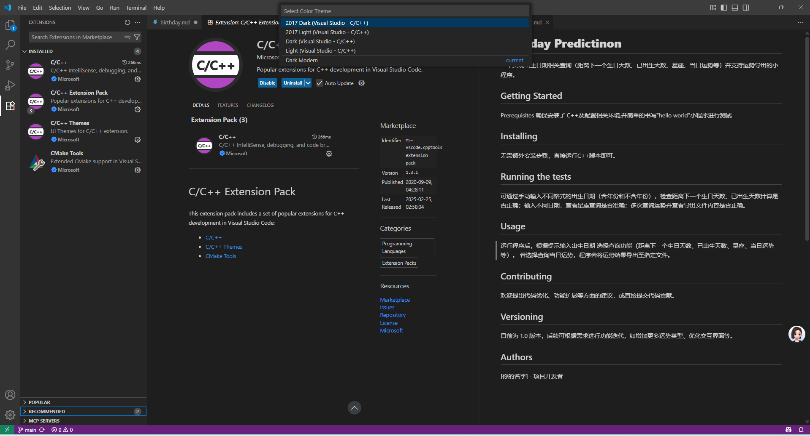
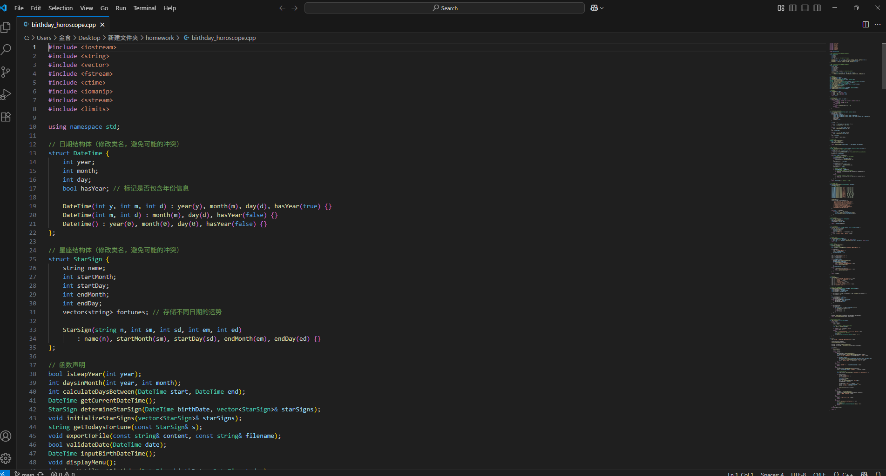
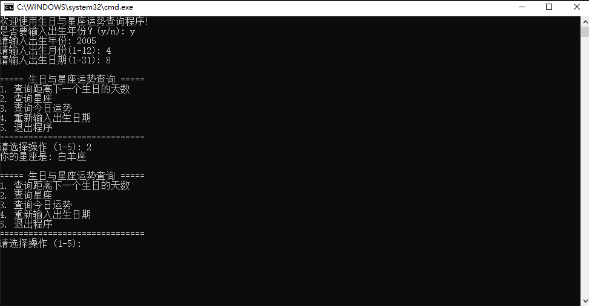

# **Birthday Predictinon**
一个实现出生日期相关查询（距离下一个生日天数、已出生天数、星座、当日运势等）并支持运势导出的小程序。
## Getting Started
Prerequisites
确保安装了 C++相关插件及配置相关环境（mingw）,并简单的书写“hello world"小程序进行测试

## Installing
无需额外安装步骤，直接运行C++脚本即可。

## Running the tests
可通过手动输入不同格式的出生日期（含年份和不含年份），检查距离下一个生日天数、已出生天数计算是否正确；输入不同日期，查看星座查询是否准确；多次查询运势并查看导出文件内容是否正确。

##  Usage
运行程序后，根据提示输入出生日期
选择查询功能（距离下一个生日天数、已出生天数、星座、当日运势等）。
若选择查询当日运势，程序会将运势结果导出至指定文件。
## Contributing
欢迎提出代码优化、功能扩展等方面的建议，或直接提交代码贡献。
## Versioning
目前为 1.0 版本，后续可根据需求进行功能迭代，如增加更多运势类型、优化交互界面等。
## Authors
*谢禹阳 张博涵 李子玉 金含*