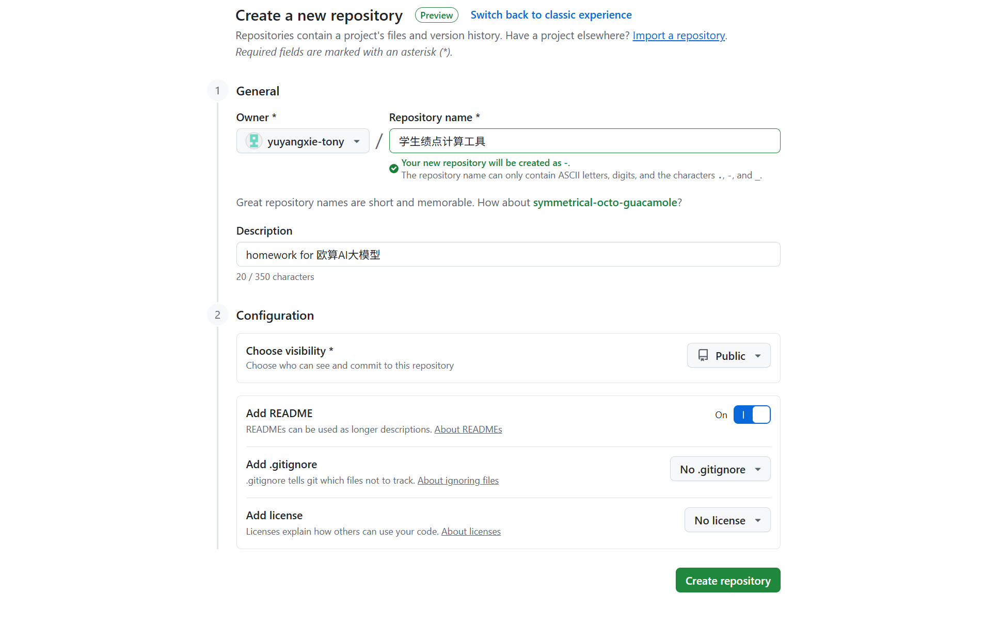
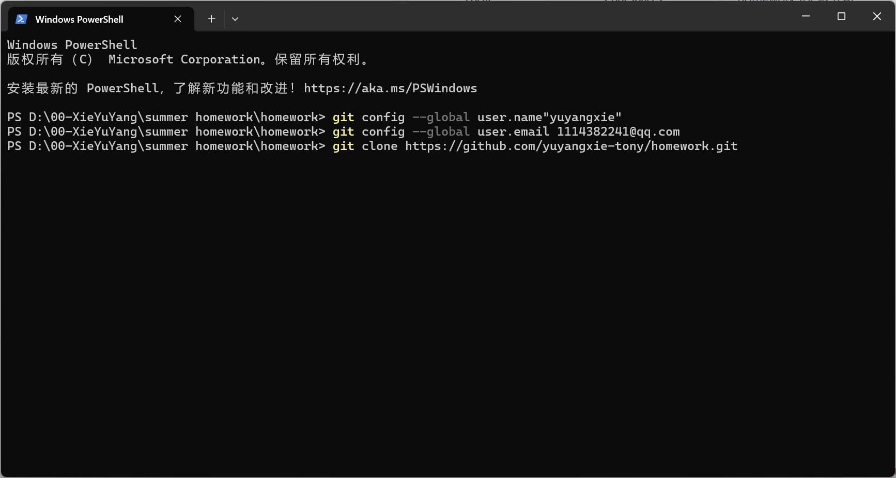
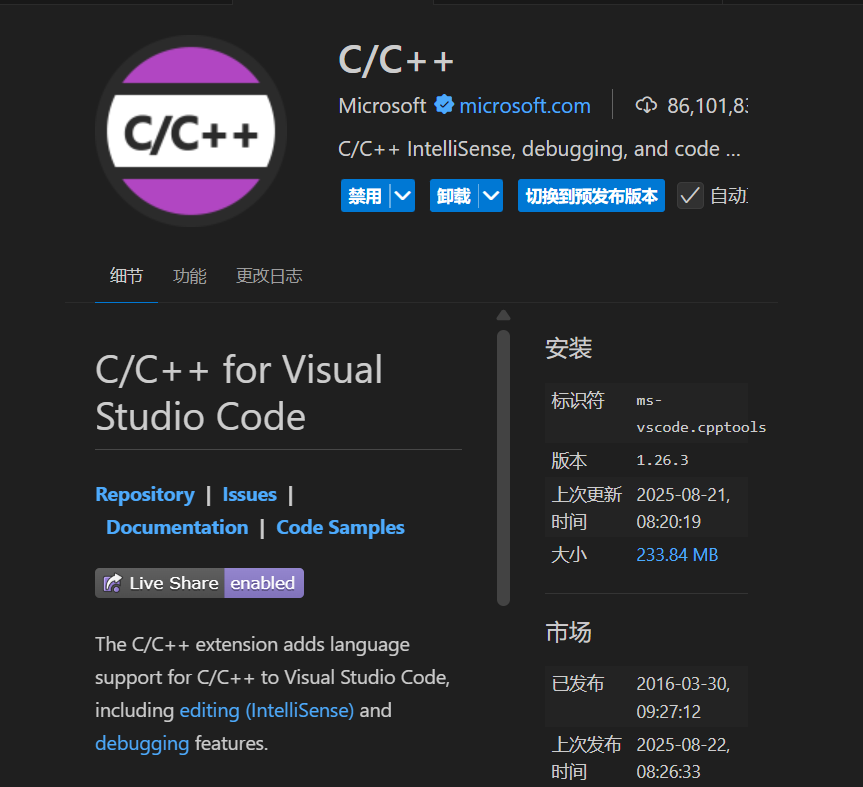
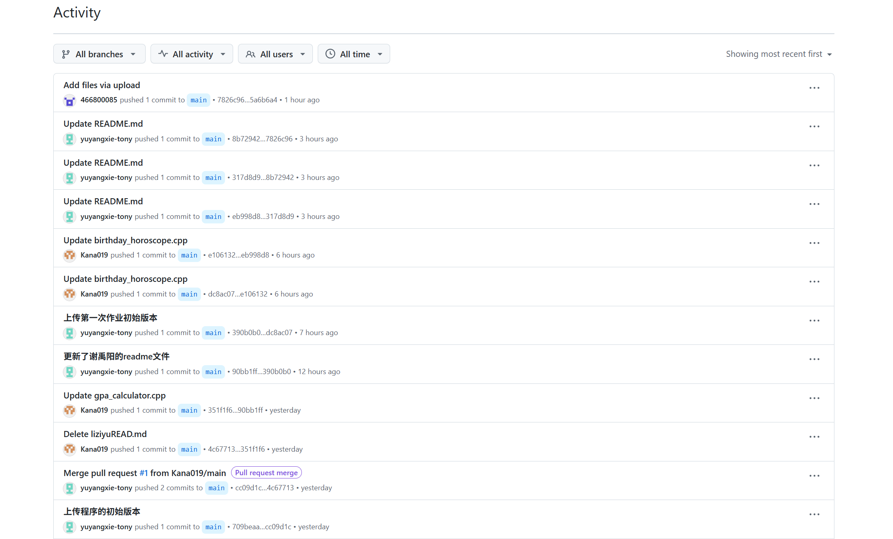

# Project Title:生日与星座运势查询
####    这个程序的主要特点和功能：
    该程序是一个集生日与星座运势查询于一体的工具，允许用户输入出
    生日期（可选择是否包含年份），能查询距离下一个生日的天数（若
    提供出生年份还会显示已出生天数），判断用户所属星座，查询当日
    星座运势并支持将运势结果导出至文件，通过清晰的菜单界面实现了
    便捷的人机交互。

# Getting Started:依赖项安装流程
1. 在[Github](https://www.github.com)上创建一个新的仓库

2. 配置本地git环境

3. 配置vscode c/c++ 环境

# Running the tests:项目测试
    对该项目的测试过程主要围绕各功能模块展开：先测试出生日期输入
    功能，验证对无效日期的纠错能力；再测试生日计算功能，通过输入
    不同日期（含跨年、闰年情况）检查倒计时和已出生天数的准确性；
    接着测试星座判断，用各星座边界日期验证匹配是否正确；最后测试
    运势查询及导出功能，确认内容正确性和文件导出是否成功，同时检
    查菜单交互的流畅性。

# Usage：使用方法
    启动程序后，会显示欢迎信息和使用说明，之后依次提示输入第 1 门课程的名称、学分（需输入正整
    数，若输入无效会提示重新输入）和成绩（需输入 0-100 之间的整数，若输入无效会提示重新输入），
    输入完成后会显示该课程的绩点并询问是否继续输入下一门课程，若输入 “y” 或 “Y” 则重复上述输
    入流程，若输入其他字符则结束输入，随后程序会显示总课程数、总学分和平均绩点，最后显示结束信
    息。
# Contributing:贡献者
**黎子裕 金含 张博涵 张博涵**
# Versioning:版本迭代

# Author:作者
***谢禹阳***
Email：<1114382241@qq.com>
# Acknowledgments:致谢
感谢所有组员在开发过程中所付出的努力
