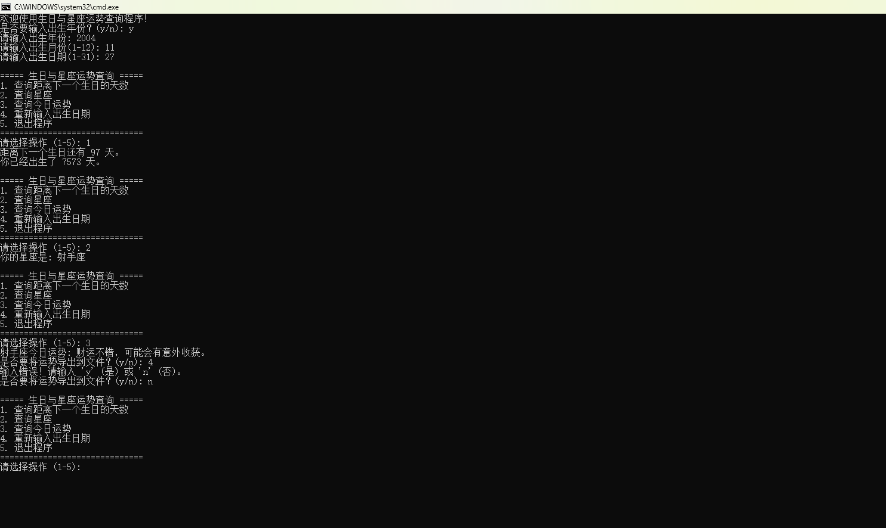
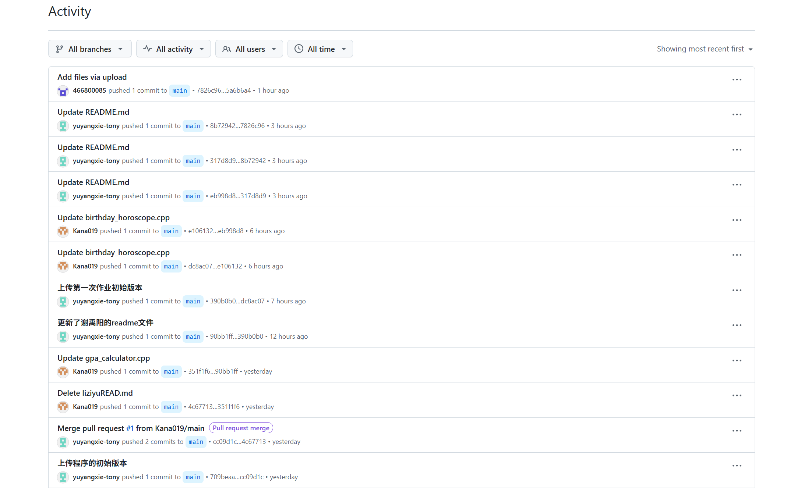

# Project Title:生日与星座运势查询
####    这个程序的主要特点和功能：
1. 生日计算：计算距离下一个生日的天数，以及已出生天数

2. 星座查询：根据出生日期确定用户的星座

3. 运势查询：提供每日随机生成的星座运势

4. 数据导出：可以将运势信息导出到文本文件
# Getting Started:依赖项安装流程
1. 在[Github](https://www.github.com)上创建一个新的仓库
2. 配置本地git环境
3. 下载vscode
4. 配置vscode c/c++ 环境，例如下载 MinGW-64
5. 验证开发环境
6. 获取和编译星座程序，运行并检查故障

现在您的开发环境应该已经配置完成，可以开始使用生日与星座运势查询程序了！

# Running the tests:项目测试
    1. 手动测试：直接运行程序，按照上述用例逐一生成输入，观察输出是否符合预期。
    2. 闰年测试，test_leapyear.cpp
    3. 月份天数测试，test_daysinmonth.cpp
    4. 星座判断测试，创建 test_starsigns.cpp
    5.完整程序测试脚本，创建 test_full_program.sh
    6.内存使用测试
    7.生成测试报告

# Usage：使用方法
    启动程序后，会显示欢迎信息和使用说明，之后会提示你输入出生日期，你会有两个选项，选项A：输入完整生日（包含年份），选项B：只输入月日（不包含年份）。（注意：程序会自动验证日期有效性，如2月30日会被拒绝。）
    输入生日后显示主菜单：
   1. 查询距离下一个生日的天数
   2. 查询星座
   3. 查询今日运势
   4. 重新输入出生日期
   5. 退出程序选择相应的功能，程序会输出对应的结果。
##### 退出程序
正常退出：选择菜单选项 5
强制退出：按 Ctrl + C（不推荐）
# Contributing:贡献者
**黎子裕 金含 张博涵**
# Versioning:版本迭代

# Author:作者
***谢禹阳***
Email：<1114382241@qq.com>
# Acknowledgments:致谢
感谢所有组员在开发过程中所付出的努力
